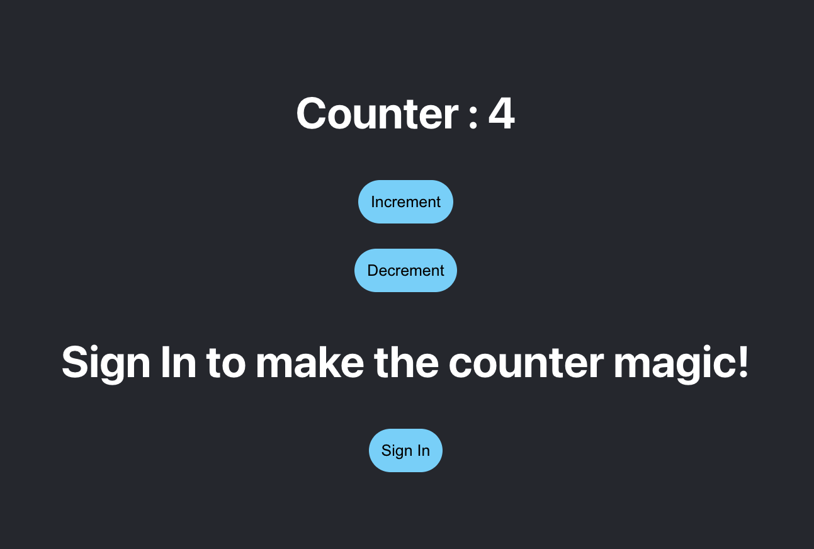
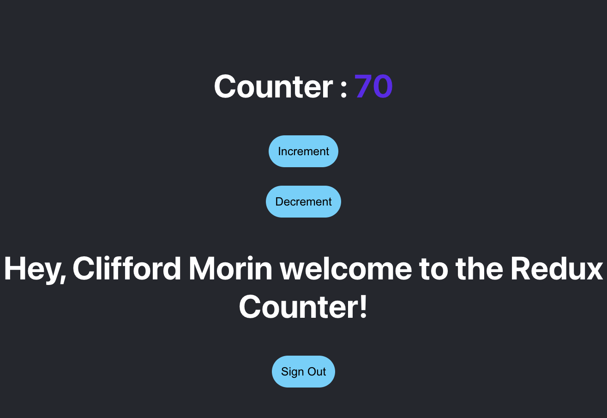

# Redux-Counter-App

</br>
<p align="center">
    
    
    
       
    
    
      
      
      
</p>

[](https://github.com/git/git-scm.com/blob/main/MIT-LICENSE.txt)

## Description

This is a very simple counter application that use React Redux and Auth0 as a authentication system to sign into the application. When a users signs in the counter number changes color on increment or decrement.

## User Story

```
Create an application that uses react redux and a login/ logout option. When a user logins in ther are brought to a updated page with that user's name and different components. 
```

## Table of Contents

- [Usage](#usage)
- [Links](#links)
- [Technologies Used](#technologies-used)
- [License](#license)
- [Contributions](#contributions)
- [Questions](#questions)

## Usage




## Links

- App demo site link: (https://reduxcount.netlify.app/)
- Github Repository URL: (https://github.com/CliffordMorin/Redux-Counter-App)

## Technologies Used

<p align="center">
    
    
    
    
    
    
    
</p>

## License

[](https://github.com/git/git-scm.com/blob/main/MIT-LICENSE.txt)

## Contributions

Fork, request, or contact me.

## Questions

[](https://github.com/CliffordMorin)
[](https://www.linkedin.com/in/morin-clifford-129888a9/)

Feel free to reach me at cemorin21@gmail.com with any question regarding this project!